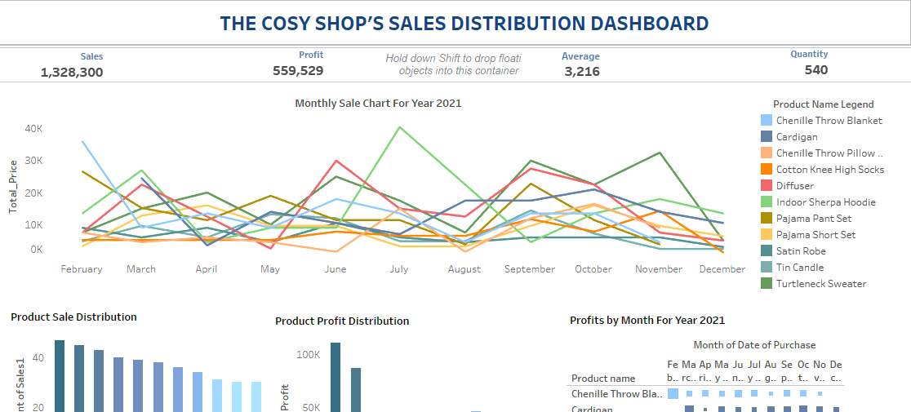
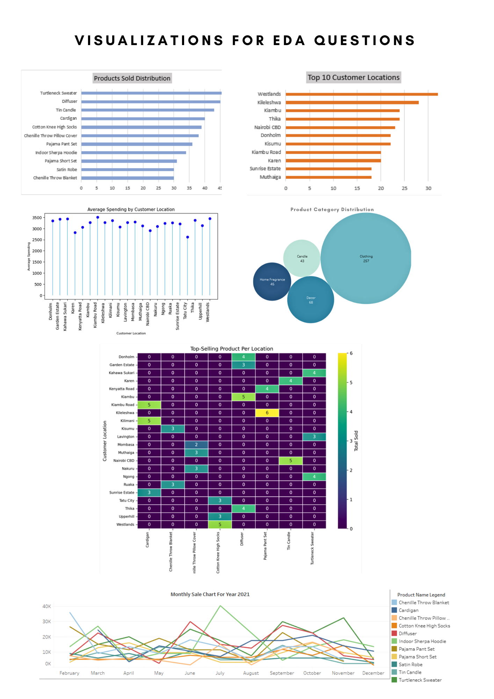

# The Cosy Shop's Sales Analysis

### Table of Contents

### Project Overview

This data analysis project takes a personal retrospective look at an online store I founded in the year 2021. Through the lens of an analyst, we will time travel one last time to explore the shop's data. The purpose of this project is to uncover hidden patterns and interaction between product sold and the customer behaviour. This will then inform strategic marketing decisions and provide a deeper
understanding of the business' performance during it's operational period. 

---

### Data Sources

The primary data for this analysis is 'Rawdata.xlsl', containing two worksheets; Products and Sales. It was intitially collected but was later refined by extending the entries to provide a more comprehensive dataset.

### Tools
In this project, I use a combination of four tools; Python, Excel, Tableau, and MySQL queries to showcase technical versatility.

- **Excel**
  - Data cleaning and Organization
  - Analysis
  - Visualization
- **Python(Pandas, Matplotlib, Seaborn)**
  - Data Preprosessing
  - Exploratory Data Analysis
  - Data Visualization
- **Tableau**
  - Visualization
- **MySQL**
  - Exploratory Data Analysis Questions SQL queries

### Data Cleaning/Preparation

I began by cleaning the raw data in Excel, using functions like removing duplicates and applying VLOOKUP to create a product_name column. This cleaned dataset was then used for further analysis and visualizations in Excel and later imported into MySQL for writing queries to answer exploratory data analysis (EDA) questions. Additionally, the data was imported into Tableau for dashboard creation.

For Python, I split the raw data into two CSV files; Products and Sales, which were then merged, cleaned, analyzed, and visualized in Jupyter Notebooks using Matplotlib and Seaborn.

### Exploratory Data Analysis(EDA)
On top of insights here are some questions that need to be answered

 1. What is the distribution of products sold?
 2. What are the top 10 customer locations based on sales volume?
 3. What is the average amount spent per customer location?
 4. What is the best performing product category?
 5. What is the top-selling product per customer location?
 6. What was the monthly bestseller?

### Data Analysis
### Results/Findings
  Here are the answers to the EDA questions using visualizations 
  
  Other findings:
  -  Product visibility and engagement decline after sustained exposure, indicating noticeable fatigue over time. 
  -  The clothing category, especially knitwear, consistently outperforms other product lines.
  -  Nairobi emerges as the top-performing region, significantly surpassing other locations.
  -  Retention rates are relatively low, highlighting an opportunity to improve long-term customer engagement.
 
### Recommendations

  - Diversify and implement fast product rotation for products that are performing well, such as sweaters, diffusers, candles, and cardigans.
  - Increase marketing campaigns in Westlands, Thika, Donholm, and Kileleshwa, as these areas show higher buying activity and spending.
  - Focus on increasing customer engagement through interactive content like polls, Q&A sessions, and user-generated content to build - 
stronger brand loyalty and foster a community feel, which can convert followers into repeat customers.

### Limitations
### References

